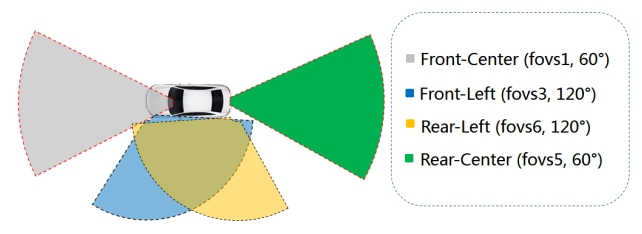
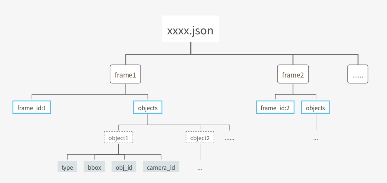
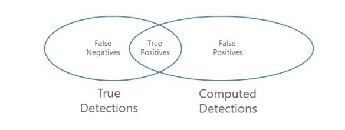
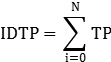
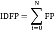
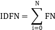
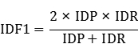
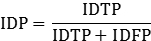
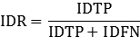
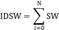

# ***WACV CalmCar Autonomous Challenge***

 

### ***Multi-Target Multi-Camera Tracking***  

 

### **I.** ***General Information*** 

Multi-target, multi-camera (MTMC) tracking systems can automatically track multiple vehicles through an array of cameras. In this challenge, participants are required to design robust MTMC algorithms targeting at vehicles, where the same vehicles captured by different cameras possess the same tracking ID.  The competitors will have access to four large-scale training datasets, each of which includes around 4800 RGB video frames, with well-labeled vehicle types, tracking IDs and 2D annotations. Identification precision (IDP) and identification recall (IDR) will be computed to evaluate the accuracy of the submitted methods. The competitors are required to submit their pretrained models as well as the corresponding docker image files for algorithm evaluation (in terms of both speed and accuracy).

  

 

### **II.** ***Datasets***

We provide six datasets, including four training sets and two testing sets, in total, each of which contains a group of videos captured by cameras at different positions (Front-Center, Front-Left, Rear-Left, and Rear-Center). In the training sets, annotations of vehicles such as 2-D bounding box, vehicle type, and tracking ID are available. While in the testing sets, participants are required to predict tracking IDs of vehicles according to the given 2-D bounding box, vehicle type, and video frame information. Note that the same vehicle may appear in different cameras at the same time, and we require the track-ID of the same vehicle to stay the same. Video file is named as starting time+camera name. For instance, video captured by fovs1 at 07h34m22s on 2020/09/02 is named as 2020-09-02-07-34-22_fovs1.mp4

Figure 1. Camera Positions

    

### **III.** ***Annotation***

Annotation results of all datasets are stored in json files. Note that each json file includes annotation results of videos captured by the four cameras.

 

Figure 2. Structure of json annotations

* Annotation results is stored in frame-based list object, as follow, json data = [frame1,frame2,......]. The k-th frame is a dict object {"frame_id"x"objects":xx}。

* "frame_id": int type. Frame number of current frame, 0-based.

* "objects": list of objects. In this challenge, only annotations of vehicles are available. 

* "object": dict of object information. object={"bbox": xx, "type": xx, "obj_id": xx, "camera_id": xx}.

* "bbox": list type. [xmin, ymin, xmax, ymax]. 

* "type": string type. The type of object, one of {"car","bus","truck"}

* "obj_id": int type. Tracking id of object. Participants need give out the predict value of "obj_id" in testing sets. 

* "camera_id": int type. Index of camera that capture this object. Table 1 shows the mapping from camera_id to video name

| ***camera_id***  | 1             | 2             | 3             | 4             |
| ---------------- | ------------- | ------------- | ------------- | ------------- |
| ***video_name*** | xxx_fovs1.mp4 | xxx_fovs6.mp4 | xxx_fovs3.mp4 | xxx_fovs5.mp4 |

Tabel 1. mapping from camera_id to video name

   

### **IV.** ***Evaluation***  

 

#### ***Evaluation Metric***

We use IDF1 as the final score of prediction while IDSW is also taking into consideration.

   

#### ***IDF1***

IDF1 is based on the commonly used evaluation metrics Recall and Precsion in binary classification. 

| LabelPrediction | Positive | Negative |
| --------------- | -------- | -------- |
| Positive        | TP       | FN       |
| Negative        | FP       | TN       |

 

 

TP is the number of correct id predictions of a single object. FP is the number of false positive id predictions of a single object. FN is the number of false negative id predictions of a single object. Note that these calculations are based on the data of the four videos.

IDTP, IDFP and IDFN represent the sum of TP, FP and FN of all objects respectively.

 

 

 

IDF1, IDP and IDR are calculated as follows:

 

 

 

   

#### ***IDSW***

SW is the number of id switches of a single object, while IDSW is the sum of SW of all objects in the four videos.

 

   

#### ***Evaluation Procedure***

1. Get id-sets of all annotation results.

2. For idt in id-sets:
      a) get all frame-based bbox of object idt
      b) generate id_list of prediction according to frame-based bbox.
      c) take the mode idc of id_list as correct prediction id.
      d) calculate TP, FP, FN, SW

3. calculate IDTP, IDFP, IDFN, IDSW.

4. calculate IDF1 value (3 digits after the decimal points). Compare IDSW value if IDF1 values of two submits are the same.

   

#### **V.** ***Submission Rules***

* Only receive json format submits.

* The structure should be the same as the given annotation json file. Predicition results of one group of videos store in one json file. Take the video name as the json file name(for example, 2017-07-04-07-59-39.json)

* No "None" value or " " value

* Prediction of id should be an integer and id >=1   

* Frame_id(0-based) and camera_id needs to be correct

* All objects with a 2D bounding bbox need to predict id

submission will be rejected if not in correct format.

    

#### **VI.** ***Instructions***

1. Register at the [CMT submission system](https://cmt3.research.microsoft.com/AVV2021/) and obtain the submission ID (select ***Challenge: CalmCar MTMC*** in the subject area).

2. Download the dataset from …

3. Submit the pretrained model, source code, and a docker image on the [CMT submission system](https://cmt3.research.microsoft.com/AVV2021/) (by simply adding an attachment to the registration) for evaluation.

    

#### **VII.** ***Contact***

shaojuan.fan@calmcar.com; xinliang.peng@calmcar.com;

 